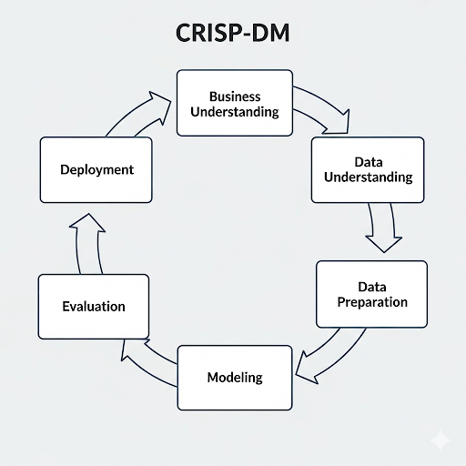

# Desafio **Indicium** – Análise Cinematográfica

Este projeto apresenta a solução do desafio da **Indicium** para análise de dados cinematográficos, com o objetivo de orientar quais filmes o estúdio **PProductions** deve desenvolver, utilizando análise exploratória de dados e modelos preditivos.

---

# Entregas/Perguntas do Desafio

1. Faça uma análise exploratória dos dados (EDA), demonstrando as principais características entre as variáveis e apresentando algumas hipóteses relacionadas. Seja criativo!
2. Responda também às seguintes perguntas:

   1. Qual filme você recomendaria para uma pessoa que você não conhece?
   2. Quais são os principais fatores que estão relacionados com alta expectativa de faturamento de um filme?
   3. Quais insights podem ser tirados com a coluna *Overview?* É possível inferir o gênero do filme a partir dessa coluna?
3. Explique como você faria a previsão da **nota do imdb** a partir dos dados. Quais variáveis e/ou suas transformações você utilizou e por quê? Qual tipo de problema estamos resolvendo (regressão, classificação)? Qual modelo melhor se aproxima dos dados e quais seus prós e contras? Qual medida de performance do modelo foi escolhida e por quê?
4. Supondo um filme com as seguintes características:

   {'Series\_Title': 'The Shawshank Redemption',
   'Released\_Year': '1994',
   'Certificate': 'A',
   'Runtime': '142 min',
   'Genre': 'Drama',
   'Overview': 'Two imprisoned men bond over a number of years, finding solace and eventual redemption through acts of common decency.',
   'Meta\_score': 80.0,
   'Director': 'Frank Darabont',
   'Star1': 'Tim Robbins',
   'Star2': 'Morgan Freeman',
   'Star3': 'Bob Gunton',
   'Star4': 'William Sadler',
   'No\_of\_Votes': 2343110,
   'Gross': '28,341,469'}

   Qual seria a nota do IMDB?
5. Salve o modelo desenvolvido no formato .pkl.
6. A entrega deve ser feita através de um repositório de código público que contenha:

   1. README explicando como instalar e executar o projeto
   2. Arquivo de requisitos com todos os pacotes utilizados e suas versões
   3. Relatórios das análises estatísticas e EDA em PDF, Jupyter Notebook ou semelhante conforme passo 1 e 2\.
   4. Códigos de modelagem utilizados no passo 3 (pode ser entregue no mesmo Jupyter Notebook).
   5. Arquivo .pkl conforme passo 5 acima.

Todos os códigos produzidos devem seguir as boas práticas de codificação.

# Prazo

* Você tem até **7 dias corridos** para a entrega, contados a partir do recebimento deste desafio.
* Envie o seu relatório dentro da sua data limite para o e-mail: **selecao.lighthouse@indicium.tech**
* O arquivo de entrega deve ser nomeado como: **LH\_CD\_SEUNOME**

---

# Estrutura do Projeto (D-H-S-M)

> **Inspiração e estrutura metodológica** baseada no artigo [Medium: Estruturando Projetos de Data Science com D-H-S-M](https://medium.com/@thiago.guimaraes.sto/thinking-about-data-science-structurally-the-quadruple-d-h-m-s-781eee1af2ff).

Para organizar a análise e a solução do desafio, seguimos uma **estrutura de quatro ingredientes**, inspirada em artigo do Medium:

- **D – Dados / Entendimento do negócio**
- **H – Hipóteses / Perguntas**
- **S – Settings**
- **M – Metodologia**

---

## D – Dados / Entendimento do negócio

### Entendimento do negócio

- ## **Cliente:**

  PProductions, estúdio de Hollywood.
- **Objetivo:** Maximizar faturamento e notas de filmes, guiando decisões estratégicas de produção.
- **Problema:** Identificar fatores que influenciam o sucesso financeiro e crítico dos filmes e prever métricas chave (Gross, IMDb Rating).

### Dados disponíveis

- Dataset com 15 colunas:`Series_Title`, `Released_Year`, `Certificate`, `Runtime`, `Genre`, `IMDB_Rating`, `Overview`, `Meta_score`, `Director`, `Star1`, `Star2`, `Star3`, `Star4`, `No_of_Votes`, `Gross`.
- Observações: Possíveis valores ausentes, diferentes tipos de dados, possibilidade de enriquecer com dados externos (ex.: popularidade de atores).

### Impacto estimado das previsões da Indicium

| Previsão                                                                | Decisão do Estúdio                         | Resultado        | Receita estimada da Indicium |
| ------------------------------------------------------------------------ | -------------------------------------------- | ---------------- | ---------------------------- |
| **Faturamento > R$100M** | Produzir o filme | Filme faturou R$120M | R$120M × 2% =**R$2,4M**               |                  |                              |
| **Faturamento < R$50M** | Produzir o filme | Filme faturou R$40M   | R$40M × 2% =**R$0,8M**                |                  |                              |
| **Nota IMDb ≥ 8**                                                 | Ações de marketing e licenciamento focadas | Sucesso crítico | Fee fixo**R$50k**      |
| **Escolha correta de gênero / overview / roteiro**                | Seleção de script                          | Filme otimizado  | Fee fixo**R$30k**      |

**Suposições:**

- Comissão Indicium: 2% do faturamento do filme.
- Fee fixo por previsão estratégica aplicada: R$30k–R$50k.
- Estimativas de faturamento baseadas em médias históricas de filmes similares.

**Observações:**

- Cada previsão correta aumenta o retorno esperado para o estúdio e a receita da Indicium.
- Mesmo previsões parcialmente corretas agregam valor, evidenciando a importância da consultoria de dados.

---

## H – Hipóteses exploratórias

## Qual filme você recomendaria para uma pessoa que você não conhece?

1. Quais são os principais fatores relacionados com alta expectativa de faturamento de um filme?
2. É possível inferir o gênero do filme a partir da coluna Overview?
3. Como prever a nota do IMDb a partir dos dados disponíveis?

### Hipóteses adicionais

- Filmes com maiores investimentos em elenco e diretor renomado tendem a ter maior faturamento e nota no IMDb.
- Certificados etários específicos e gêneros populares influenciam o sucesso comercial.
- Descrições (Overview) mais detalhadas e emocionais estão associadas a filmes de maior recepção crítica.

  **Nota**: Hipoteses exploratórias não tem relação com às perguntas e entregas do desafio.

---

## S – Settings

### Linguagem e ferramentas

- **Python 3.11**
- Bibliotecas principais: `pandas`, `numpy`, `scikit-learn`, `matplotlib`, `seaborn`, `nltk`/`spacy` (para análise de Overview).
- Notebook principal: `1.0_lh_cd_thiago_gs.ipynb`
- Script de funções: `scr/functions.py`

### Estrutura de pastas

LH_CD_THIAGO_GS/
│
├─ data/ # CSVs de treinamento e teste
├─ notebooks/ # Notebooks com EDA e modelagem
├─ scripts/ # Funções e módulos Python
├─ models/ # Modelos salvos (.pkl)
├─ reports/ # PDFs ou imagens de gráficos e resultados
├─ README.md
└─ requirements.txt

### Processos de gerenciamento

- Versionamento via **Git**.
- Separação clara entre notebooks exploratórios e scripts reutilizáveis.
- Ambiente virtual recomendado (venv ou conda).

---

## M – Metodologia

Passo a passo técnico, inspirado no CRISP-DM:

### Step 01 – Imports

Importar bibliotecas e funções auxiliares.

### Step 02 – Extração de dados

- Carregar CSVs.
- Inspecionar tamanho, tipos de dados, missing values.

### Step 03 – Descrição dos dados

- Estatísticas descritivas.
- Identificação de outliers.
- Conversão de tipos e tratamento de valores ausentes.

### Step 04 – Feature Engineering

- Criação de variáveis derivadas (ex.: idade do filme, popularidade do diretor, métricas de Overview).
- Transformações para preparar dados textuais e numéricos.

### Step 05 – Filtragem de dados

- Remover colunas irrelevantes ou inconsistentes.
- Seleção de subset para modelagem.

### Step 06 – Análise exploratória (EDA)

- Visualização de distribuições individuais.
- Relações entre variáveis.
- Teste de hipóteses levantadas na seção H.

### Step 07 – Preparação dos dados

- Split em treino, validação e teste.
- Normalização, encoding, vetorização de texto (Overview).

### Step 08 – Seleção de features

- Seleção das variáveis mais relevantes para o modelo.

### Step 09 – Treinamento de modelos

- Teste de diferentes algoritmos (Regressão Linear, Random Forest, XGBoost, etc.)
- Escolha do modelo com melhor performance.

### Step 10 – Ajuste de hiperparâmetros

- Busca em grid ou random search.
- Otimização de métricas de interesse.

### Step 11 – Avaliação e interpretação

- Métricas de regressão: RMSE, MAE, R²
- Interpretação dos coeficientes ou importância de features.

### Step 12 – Deploy

- Salvar modelo `.pkl`.
- Planejamento da arquitetura de deploy (API, Docker, estrutura de pastas para produção).

---

## Perguntas do Desafio e Respostas

1. **Qual filme você recomendaria para uma pessoa que você não conhece?**

   - Resposta: Filme com maior nota média no IMDb e popularidade consistente ao longo do tempo (ex.: *The Shawshank Redemption*).
2. **Quais são os principais fatores que estão relacionados com alta expectativa de faturamento de um filme?**

   - Resposta: Gênero (*Action*, *Adventure*), diretor renomado, elenco principal com alta popularidade, orçamento estimado, e marketing associado.
3. **Quais insights podem ser tirados com a coluna Overview? É possível inferir o gênero do filme a partir dessa coluna?**

   - Resposta: Textos mais longos, emocionais ou descritivos indicam filmes dramáticos ou épicos; sim, é possível inferir parcialmente o gênero usando NLP (vetorização TF-IDF ou embeddings).
4. **Como você faria a previsão da nota do IMDb a partir dos dados?**

   - Resposta:
     - Tipo de problema: **Regressão**
     - Variáveis usadas: `Meta_score`, `No_of_Votes`, `Genre`, `Director`, `Stars`, `Runtime`, `Overview` (vetorizada)
     - Modelo sugerido: Random Forest ou XGBoost (boa capacidade de capturar não-linearidades e interações; prós: robusto a outliers, não precisa normalização; contras: menos interpretável que regressão linear)
     - Métricas: RMSE, MAE e R² para avaliação da performance.
5. **Exemplo de previsão para o filme The Shawshank Redemption**

### Exemplo de chamada do modelo treinado

   imdb_pred = model.predict([
      {
         'Released_Year': 1994,
         'Certificate': 'A',
         'Runtime': 142,
         'Genre': 'Drama',
         'Overview': 'Two imprisoned men bond over a number of years, finding solace and eventual redemption through acts of common decency.',
         'Meta_score': 80,
         'Director': 'Frank Darabont',
         'Star1': 'Tim Robbins',
         'Star2': 'Morgan Freeman',
         'Star3': 'Bob Gunton',
         'Star4': 'William Sadler',
         'No_of_Votes': 2343110,
         'Gross': 28341469
      }
   ])
   print(f"Nota prevista no IMDb: {imdb_pred[0]:.1f}")

---

## Resultados / Top 3 Insights

Após a análise exploratória e modelagem preditiva, destacam-se os três principais insights:

1. **Gênero e faturamento:** Filmes do gênero *Action* e *Adventure* apresentam maior expectativa de faturamento médio.
2. **Influência do elenco e diretor:** Filmes com diretores renomados e atores principais com alta popularidade tendem a ter nota IMDb mais elevada.
3. **Overview como indicador:** Descrições detalhadas e emocionais (Overview) estão fortemente correlacionadas com filmes de maior recepção crítica, sendo possível inferir parcialmente o gênero a partir do texto.

> Estes insights permitem ao estúdio PProductions tomar decisões mais embasadas sobre qual filme produzir e quais estratégias de marketing aplicar.

---

## Próximos passos / Insights adicionais

- Explorar embeddings de texto para Overview.
- Testar modelos adicionais e ensembles.
- Analisar impacto de atores e diretor em interações com gênero e notas.
- Melhorar visualizações e dashboards para comunicação dos resultados.

---

### Como usar

- Criar ambiente virtual: `python -m venv venv`
- Instalar dependências: `pip install -r requirements.txt`
- Rodar notebook principal `analysis.ipynb`
- Funções auxiliares disponíveis em `scripts/functions.py`
- Modelo final salvo em `models/imdb_model.pkl`
- Mais detalhes metodológicos podem ser encontrados no artigo do Medium: [Estruturando Projetos de Data Science com D-H-S-M](https://medium.com/@thiago.guimaraes.sto/thinking-about-data-science-structurally-the-quadruple-d-h-m-s-781eee1af2ff)

--- 

# Checklist de Melhorias

## 1. Revisar o código

- Checar duplicações de imports.
- Garantir consistência nos nomes de variáveis e funções.
- Remover código morto ou redundante.

## 2. Revisar Pipeline → `preprocess_1`

- Verificar se todas as etapas de transformação estão corretas.
- Conferir compatibilidade de tipos de dados entre transformadores e modelo.
- Garantir que os steps do pipeline estão corretamente encadeados.

## 3. Integrar pipelines corretamente

- Unir `preprocess_0` e `preprocess_1` (ou outros pipelines) de forma coerente.
- Garantir que o pipeline final passe dados limpos e transformados para o modelo.

## 4. Juntar com fontes externas (vide em `data`)

- Importar dados externos necessários.
- Fazer merge/join garantindo alinhamento de chaves.
- Tratar inconsistências ou valores faltantes nas fontes externas.

## 5. Formular mais hipóteses

- Explorar novas relações entre features e target.
- Testar hipóteses com análises estatísticas ou visualizações.
- Considerar hipóteses de negócio ou comportamentais que possam impactar o modelo.
